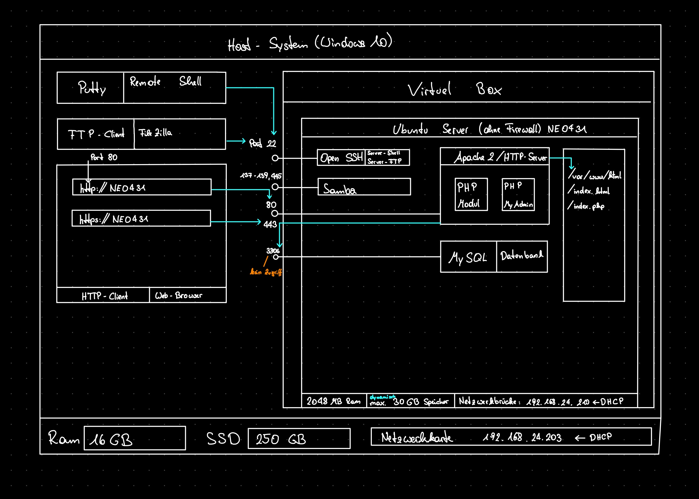

# 👋 Hi, I’m @pobe22
  - 👀 I’m interested in web projects and small python scripts
  - 🌱 I’m currently learning C#
  - 😄 Pronouns: he/they
     
     

    Current Ubuntu-Server Setup im working at in school:
     
     
    

    ## Web Projects:
    
    [Hotel Vallora](https://github.com/pobe22/WebprojektHotel)
    
    website from scratch about a imaginary hotel
     
     

    [Boards of Canada](https://github.com/pobe22/BoardsOfCanada)
    
    bootstrap site about one of my favourite bands
     
     
    
    [Toki Pona](https://github.com/pobe22/tokipona)
    
    learning tool for concept language "toki pona"
     
     
    

    ## Python Projects:
    
    [SEO](https://github.com/pobe22/SEO)
    
    script for search engine optimization
     
     
    
    [Quiz Game](https://github.com/pobe22/spiel)

    interactive quiz game for school questions
     
     
    
    [Spotify Playlist Backup](https://github.com/pobe22/automate_spotify_simple)

    automated script for playlist logging
     
     

    [SoundCloud Downloader](https://github.com/pobe22/sc_downloader)

    automated downloader for soundcloud playlists
     
     

    ## C# Projects:
    
    [Tierpension](https://github.com/pobe22/Tierpension)

    animal shelter made with wpf
     
     
    
    [Collection](https://github.com/pobe22/Collection)

    small project to test out data structures
     
     
    
    ## .NET Core Projects:
    
    [StreamingZeiger](https://github.com/pobe22/StreamingZeiger)

    web project for managing and recommmending movies and series
     
     
    
    [ProjectMate](https://github.com/pobe22/ProjectMate)

    web-based project manager
     
     

    [Archery](https://github.com/pobe22/Archery)

    web project for tracking games in 3D archery 
    

